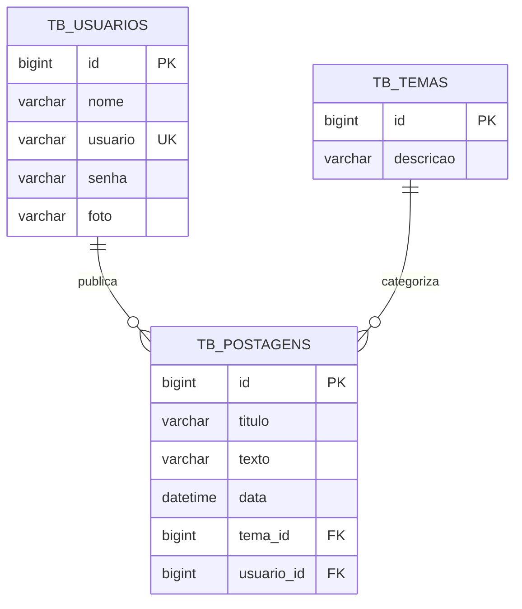

# 📰 Blog Pessoal API — Back-End em NestJS


---

## 🔗 Acesso e Documentação Interativa

* **Ambiente Local:** `http://localhost:8080`
* **Documentação Swagger UI:** `http://localhost:8080/` (Redirecionamento automático configurado no `AppController`)
* **OpenAPI Schema (JSON):** `http://localhost:8080/swagger-json`

---

## 📖 Visão Geral

A **Blog Pessoal API** é uma solução de back-end robusta e escalável desenvolvida com o framework **NestJS 11**, **TypeScript** e **TypeORM**, concebida como o núcleo de processamento de regras de negócio para a plataforma Blog Pessoal no bootcamp **Generation Brasil (Turma JS13)**.

A aplicação adota o padrão de arquitetura modular orientada a serviços, provendo endpoints seguros para registro e autenticação de usuários via tokens **JWT (JSON Web Tokens)**, gerenciamento de categorias/temas e publicação de artigos em formato de postagens. A API conta com validação declarativa de dados, hashing de credenciais com **BCrypt**, documentação interativa automatizada com **Swagger** e suporte a múltiplos bancos relacionais (MySQL em desenvolvimento local, PostgreSQL para deploy e SQLite em memória para testes automatizados).

---

## ✨ Funcionalidades

* 🔐 **Módulo de Autenticação e Segurança (`/auth`):**
  * Login com validação de credenciais criptografadas (`bcrypt`).
  * Emissão de token JWT assinado com tempo de expiração para autorização stateless.
  * Proteção declarativa de rotas via `@UseGuards(JwtAuthGuard)`.
* 👤 **Módulo de Usuários (`/usuarios`):**
  * Cadastro de novos usuários com validação estrita de e-mail e unicidade.
  * Criptografia de senhas antes da persistência no banco.
  * Consulta de perfis e atualização cadastral.
* 🏷️ **Módulo de Temas (`/tema`):**
  * CRUD completo de categorias de postagem.
  * Busca por ID e consulta textual por descrição (`/tema/descricao/:descricao`).
  * Integridade referencial vinculada às postagens.
* 📝 **Módulo de Postagens (`/postagens`):**
  * Criação de publicações vinculadas obrigatoriamente a um Usuário (autor) e a um Tema.
  * Listagem geral com relacionamentos carregados e busca por título (`/postagens/titulo/:titulo`).
  * Atualização e exclusão com validação de existência prévia.
* 📚 **Documentação OpenAPI Automatizada:** Integração com `@nestjs/swagger` gerando interface interativa com schemas e decorators `@ApiProperty` nas entidades e DTOs.

---

## 🎯 Diferenciais e Destaques Técnicos

1. **Autenticação Modular com Passport:** Implementação de estratégias isoladas (`LocalStrategy` para validação de credenciais e `JwtStrategy` para extração e validação do token Bearer no cabeçalho HTTP).
2. **Documentação Viva com Swagger:** Redirecionamento da rota raiz (`/`) diretamente para a interface visual do Swagger UI, facilitando testes manuais de endpoints por recrutadores e desenvolvedores front-end.
3. **Persistência Multi-Ambiente com TypeORM:** Estrutura configurável para operar tanto com MySQL quanto com PostgreSQL e banco em memória SQLite para suítes de teste e2e (`usuario.e2e-spec.ts`).
4. **Validação e Integridade de Dados:** Validações de tamanho, obrigatoriedade e e-mail com `class-validator` e `class-transformer`, além de exclusão em cascata configurada nas entidades relacionais.

---

## 🏗️ Arquitetura e Estrutura de Pastas

```text
src/
├── app.controller.ts            # Redirecionamento raiz para documentação Swagger
├── app.module.ts                # Módulo central com importações e configuração TypeORM
├── app.service.ts               # Serviço base da aplicação
├── main.ts                      # Bootstrap com Swagger, CORS e ValidationPipe global
├── auth/                        # Módulo de Autenticação
│   ├── auth.module.ts
│   ├── bcrypt/                  # Serviço de hash de senha (Bcrypt)
│   ├── constants/               # Constantes e segredos JWT
│   ├── controllers/             # AuthController (/auth/logar)
│   ├── entities/                # DTOs de login (UsuarioLogin)
│   ├── guard/                   # LocalAuthGuard e JwtAuthGuard
│   ├── services/                # AuthService (validação e geração de token)
│   └── strategy/                # LocalStrategy e JwtStrategy
├── postagem/                    # Módulo de Postagens
│   ├── controllers/             # PostagemController (/postagens)
│   ├── entities/                # Entidade tb_postagens (relacionada a Tema e Usuario)
│   ├── postagem.module.ts
│   └── services/                # PostagemService (regras e buscas)
├── tema/                        # Módulo de Temas
│   ├── controller/              # TemaController (/tema)
│   ├── entities/                # Entidade tb_temas
│   ├── service/                 # TemaService
│   └── tema.module.ts
└── usuario/                     # Módulo de Usuários
    ├── controller/              # UsuarioController (/usuarios)
    ├── entities/                # Entidade tb_usuarios
    ├── service/                 # UsuarioService (cadastro, hash e buscas)
    └── usuario.module.ts
```

---

## 🎲 Modelagem do Banco de Dados (DER)



---

## 🛡️ Arquitetura de Segurança

* **Hashing:** Senhas processadas com salt rounds pelo `Bcrypt` antes da inserção na base de dados.
* **Token JWT:** Gerado após autenticação com e-mail e senha, contendo o identificador do usuário e expiração configurada.
* **Proteção de Rotas:** Endpoints de escrita e leitura protegidos com `@UseGuards(JwtAuthGuard)`, exigindo o cabeçalho:
  ```http
  Authorization: Bearer <SEU_TOKEN_JWT>
  ```
* **Rotas Públicas:** `/auth/logar`, `/usuarios/cadastrar` e documentação Swagger (`/`).

---

## 📋 Tabela de Endpoints

### 1. Autenticação & Usuários
| Método | Rota | Autenticação | Descrição |
| :--- | :--- | :--- | :--- |
| `POST` | `/auth/logar` | Pública | Autentica usuário e emite o token JWT |
| `POST` | `/usuarios/cadastrar` | Pública | Registra um novo usuário com senha criptografada |
| `GET` | `/usuarios/all` | Requerida | Lista todos os usuários cadastrados |
| `GET` | `/usuarios/:id` | Requerida | Consulta usuário por ID |
| `PUT` | `/usuarios/atualizar` | Requerida | Atualiza dados cadastrais |

### 2. Temas (`/tema`)
| Método | Rota | Autenticação | Descrição |
| :--- | :--- | :--- | :--- |
| `GET` | `/tema` | Requerida | Lista todas as categorias de temas |
| `GET` | `/tema/:id` | Requerida | Consulta tema por ID |
| `GET` | `/tema/descricao/:descricao` | Requerida | Busca temas por termo textual |
| `POST` | `/tema` | Requerida | Cadastra novo tema |
| `PUT` | `/tema` | Requerida | Atualiza descrição do tema |
| `DELETE` | `/tema/:id` | Requerida | Exclui tema e propaga cascade |

### 3. Postagens (`/postagens`)
| Método | Rota | Autenticação | Descrição |
| :--- | :--- | :--- | :--- |
| `GET` | `/postagens` | Requerida | Lista postagens com autor e tema anexados |
| `GET` | `/postagens/:id` | Requerida | Consulta postagem por ID |
| `GET` | `/postagens/titulo/:titulo` | Requerida | Busca postagens por título |
| `POST` | `/postagens` | Requerida | Publica nova postagem vinculando tema e usuário |
| `PUT` | `/postagens` | Requerida | Atualiza conteúdo da postagem |
| `DELETE` | `/postagens/:id` | Requerida | Exclui postagem |

---

## ⚙️ Requisitos e Instalação

### Pré-requisitos
* **Node.js:** Versão 18 ou superior.
* **Banco de Dados:** MySQL 8.0 ou PostgreSQL ativo na porta correspondente.
* **Gerenciador de Pacotes:** `npm`.

### 1. Clonar o Repositório
```bash
git clone https://github.com/erickystn/generation_JS13_blogpessoal.git
cd generation_JS13_blogpessoal
```

### 2. Instalar as Dependências
```bash
npm install
```

### 3. Configurar Variáveis de Ambiente
Crie um arquivo `.env` na raiz do projeto:
```env
PORT=8080
DB_HOST=localhost
DB_PORT=3306
DB_USER=root
DB_PASSWORD=root
DB_NAME=db_blogpessoal
JWT_SECRET=seu_segredo_jwt_super_seguro
```

---

## 🚀 Como Executar

```bash
# Execução em modo de desenvolvimento (com recarga automática):
npm run start:dev

# Compilação do projeto para produção:
npm run build

# Execução do bundle gerado:
npm run start:prod
```

Acesse a documentação Swagger interativa em `http://localhost:8080/`.

---

## 💻 Exemplos de Requisições

### 1. Login e Obtenção de Token (`POST /auth/logar`)
```bash
curl -X POST http://localhost:8080/auth/logar \
  -H "Content-Type: application/json" \
  -d '{
    "usuario": "ericky@email.com",
    "senha": "senhaSegura123"
  }'
```

**Resposta (200 OK):**
```json
{
  "id": 1,
  "nome": "Ericky Santana",
  "usuario": "ericky@email.com",
  "foto": "https://i.imgur.com/foto.png",
  "token": "Bearer eyJhbGciOiJIUzI1NiIsInR5cCI6IkpXVCJ9..."
}
```

---

### 2. Publicar Postagem (`POST /postagens`)
```bash
curl -X POST http://localhost:8080/postagens \
  -H "Content-Type: application/json" \
  -H "Authorization: Bearer <SEU_TOKEN_JWT>" \
  -d '{
    "titulo": "Novidades do NestJS 11",
    "texto": "Explorando as novas funcionalidades e desempenho do NestJS.",
    "tema": {
      "id": 1
    }
  }'
```

---

## 🧪 Suíte de Testes

A API inclui suíte de testes de ponta a ponta (e2e) para o módulo de usuários utilizando banco de dados SQLite em memória:

```bash
# Executar testes unitários
npm run test

# Executar testes end-to-end com SQLite in-memory
npm run test:e2e
```

---

## 🛠️ Tecnologias Utilizadas

| Tecnologia | Versão | Finalidade |
| :--- | :--- | :--- |
| **NestJS** | 11.0 | Framework corporativo para Node.js |
| **TypeScript** | 5.7 | Tipagem estática e decorators |
| **TypeORM** | 0.3 | Mapeamento Objeto-Relacional (ORM) |
| **MySQL2 / pg** | 3.19 / 8.20 | Drivers de banco relacional |
| **Passport & JWT** | 0.7 / 4.0 | Autenticação e estratégias stateless |
| **Bcrypt** | 6.0 | Hashing criptográfico de senhas |
| **Swagger / OpenAPI**| 11.2 | Geração e visualização interativa da API |
| **SQLite3** | 5.1 | Banco em memória para execução de testes e2e isolados |
| **Class Validator**| 0.14 | Validação declarativa de requisições |

---

## 📈 Melhorias e Próximos Passos (Roadmap)

- [ ] Paginação de resultados nas listagens de temas e postagens (`page` e `limit`).
- [ ] Envio de e-mails transacionais para recuperação de senha.
- [ ] Sistema de comentários vinculado às postagens.
- [ ] Containerização com `Dockerfile` e `docker-compose.yml`.

---

## 🤝 Como Contribuir

1. Faça um **Fork** do repositório.
2. Crie uma branch dedicada (`git checkout -b feature/sua-feature`).
3. Commit suas modificações (`git commit -m 'feat: adiciona comentarios nas postagens'`).
4. Envie para o seu fork (`git push origin feature/sua-feature`).
5. Abra um **Pull Request**.

---

## 👤 Autor & 📄 Licença

Desenvolvido por **[Ericky Sant'ana](https://github.com/erickystn)** durante o bootcamp da **Generation Brasil**.

Distribuído sob a licença **MIT**.
